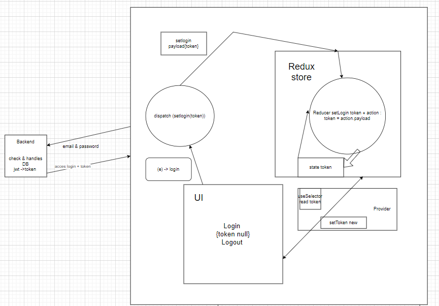

# Getting Started with Create React App

This project was bootstrapped with [Create React App](https://github.com/facebook/create-react-app).

## Available Scripts

In the project directory, you can run:

### `npm start`

Runs the app in the development mode.\
Open [http://localhost:3000](http://localhost:3000) to view it in your browser.

The page will reload when you make changes.\
You may also see any lint errors in the console.

### `npm test`

Launches the test runner in the interactive watch mode.\
See the section about [running tests](https://facebook.github.io/create-react-app/docs/running-tests) for more information.

### `npm run build`

Builds the app for production to the `build` folder.\
It correctly bundles React in production mode and optimizes the build for the best performance.

The build is minified and the filenames include the hashes.\
Your app is ready to be deployed!

See the section about [deployment](https://facebook.github.io/create-react-app/docs/deployment) for more information.

### `npm run eject`

**Note: this is a one-way operation. Once you `eject`, you can't go back!**

If you aren't satisfied with the build tool and configuration choices, you can `eject` at any time. This command will remove the single build dependency from your project.

Instead, it will copy all the configuration files and the transitive dependencies (webpack, Babel, ESLint, etc) right into your project so you have full control over them. All of the commands except `eject` will still work, but they will point to the copied scripts so you can tweak them. At this point you're on your own.

You don't have to ever use `eject`. The curated feature set is suitable for small and middle deployments, and you shouldn't feel obligated to use this feature. However we understand that this tool wouldn't be useful if you couldn't customize it when you are ready for it.

## Learn More

You can learn more in the [Create React App documentation](https://facebook.github.io/create-react-app/docs/getting-started).

To learn React, check out the [React documentation](https://reactjs.org/).

### Code Splitting

This section has moved here: [https://facebook.github.io/create-react-app/docs/code-splitting](https://facebook.github.io/create-react-app/docs/code-splitting)

### Analyzing the Bundle Size

This section has moved here: [https://facebook.github.io/create-react-app/docs/analyzing-the-bundle-size](https://facebook.github.io/create-react-app/docs/analyzing-the-bundle-size)

### Making a Progressive Web App

This section has moved here: [https://facebook.github.io/create-react-app/docs/making-a-progressive-web-app](https://facebook.github.io/create-react-app/docs/making-a-progressive-web-app)

### Advanced Configuration

This section has moved here: [https://facebook.github.io/create-react-app/docs/advanced-configuration](https://facebook.github.io/create-react-app/docs/advanced-configuration)

### Deployment

This section has moved here: [https://facebook.github.io/create-react-app/docs/deployment](https://facebook.github.io/create-react-app/docs/deployment)

### `npm run build` fails to minify

This section has moved here: [https://facebook.github.io/create-react-app/docs/troubleshooting#npm-run-build-fails-to-minify](https://facebook.github.io/create-react-app/docs/troubleshooting#npm-run-build-fails-to-minify)

// README
// react-router
// breakpoints
// positions, display, flexbox. overflows

//states, props

### Project Directory Structure

### 1 **`node_modules/`**

Contains libraries and modules my project dependencies

### 1 **`public/`**

Contains static files and HTML output files that are not processed or compiled.

### 1. **`src/`**

This directory contains the source code of my main React application

### include:

- `components/`: Include common React components used in your projectapplication ( `Header.js`,... ).

- `assets/`: Contains files images, video.

- `pages`: Contains pages of the application.
  _Each page will contain additional components, assets of that page ex:`pages/homepages/component`: include component make pagehome _

- `App.js`: Contains root component include route components

- `index.js`: The React application is rendered, and the final content is displayed in the Document Object Model (DOM) of the web browser.

-`package.json`: Configuration details for managing the project's dependencies, scripts, and other settings.

### redux-toolkid

# Onclick Login

- Client sent request include email and password to sever.
- Sever check request, if true then return token to client.
- Usedispatch() actions (setLogin) is define in reducres to push action and token to reducers

* setLogin(state,action) handles state and action.payload, here update state by value of token.
* setLogout(state) update value state is null.

- Redux store is created by configureStore of redux-toolkit received from reducres.

* useSelector() to read data from store.

# Flow redux-toolkit in app

### component

- UI call API to Backend.
- UI login: input email + password , event login logout
- Redux store: state is defined, reducers include action + state (reducers are created by configureStore in redux-toolkit)
- Provider support connections UI and Redux store
  (hook useDispatch() push acction and payload, useSelector read state from Redux store)
  ########
- gửi thông tin email password đến backend, check DB và trả về đăng nhập thành công, token được tạo jwt,id user lưu ở local storage.
- UI muốn xem thông tin người dùng từ DB cần gọi API get-info , trước đó cần kiểm tra users đã login chưa.
  { kiểm tra token, id có trên redux store không, nếu có thì users đã đăng nhập, không thì chưa đăng nhập}
- Backend kiểm tra token nếu đúng sẽ trả về thông tin người dùng
